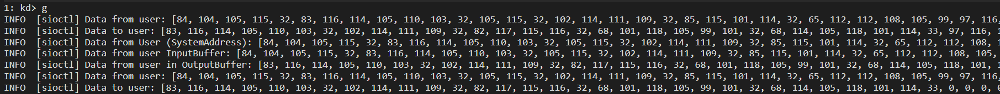

## IOCTL
This sample matches the [ioctl](https://github.com/microsoft/Windows-driver-samples/tree/main/general/ioctl) 
sample from the windows-driver-samples. Is intendend to demonstrate usage of four different types of IOCTLs.

> **Remark:** Exception capture for `ProbeForRead` and `ProbeForWrite` is not yet implemented. 
> This means that the `METHOD_NEITHER` approach remains highly unreliable and should be avoided until we have a proper 
> method for handling exceptions. The example, just for demonstration purposes, illustrates how to work with this 
> buffering method (See:[method_neither](https://github.com/n4r1b/win-drvutils-rs/blob/master/examples/sioctl/src/lib.rs#L265)). 
> However, it's important to note that, at the moment, since no probing is performed, this approach potentially unsafe. 
> Please use this sample only in controlled environments.

The sample can be tested with the executable from the MS sample. When running the executable we should get an output 
like this:

If we enable kernel verbose output then we should be able to get the following DbgPrint messages:

